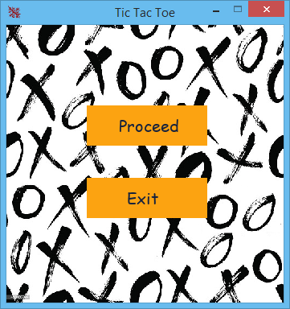
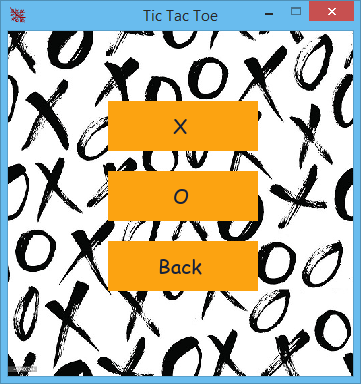
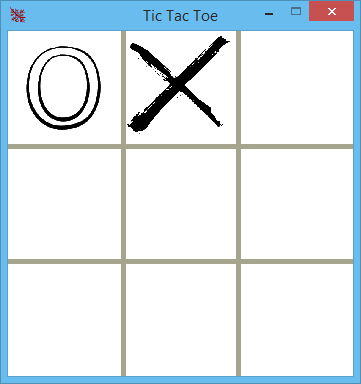
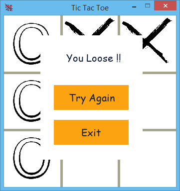

## Table of contents
* [General info](#general-info)
* [Technologies](#technologies)
* [Setup](#setup)
* [Reviews schema](#reviews-schema)

## General info
It is a tic-tac-toe game written in python using the pygame framework and the computer AI is implemented using the minimax algorithm.
	
## Technologies
Project is created with:
* Pygame version: 2.0.1
	
## Setup
To run this project, install it locally using pip:

```
$ cd ../project_name
$ pip install -r requirements.txt
```

## Reviews schema





